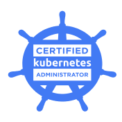

## Hi there

I'm a professional software developer with 4 years of professional experience writing Node.js (Express, and Nest),
and React applications. I also have some professional experience writing Java, Go, and Python, in addition to a
few years of using Python for personal projects. I am also a [certified kubernetes administrator](./certifications/certified-kubernetes-admin.pdf) through the Linux
Foundation.

**Current Projects**
- Terraform for provisioning VMs onto Proxmox and for building Kubernetes clusters
- Using Helm Charts to package application stacks
- Using OpenTelemetry and ClickHouse to monitor my home network
- Learning Go

**Learning Next**
- HTMX

**Links**
- [📄 Resume (PDF)](./resume/resume.pdf)
- [📧 Contact](mailto:jonathan_swanson99@pm.me)

---

